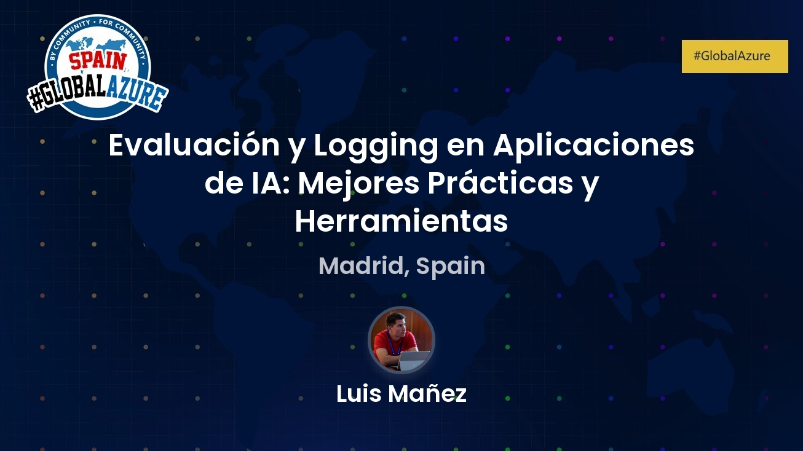

# Global Azure Bootcamp Madrid 2025 (10 de Mayo de 2025)

Materiales de mi sesión "Evaluación y Logging en Aplicaciones de IA: Mejores Prácticas y Herramientas" impartida en el Global Azure Bootcamp Madrid 2025

## Evaluacion Aplicaciones IA
Has implementado IA en tu aplicación, ¡felicidades! Pero, ¿y ahora qué? Aquí viene la parte divertida: asegurarte de que todo funcione como debe. En esta sesión vamos a hablar de cómo evaluar y monitorear el rendimiento de tus modelos de IA, y te contaremos algunos trucos para gestionar registros de actividad sin volverte loco. También exploraremos las mejores herramientas para mantener todo en orden, como Azure Monitor y Application Insights, que son como tener un asistente personal vigilando que tu IA no se desvíe del camino. Porque ya sabes, lo último que quieres es que tu IA empiece a hacer cosas raras cuando nadie la está mirando.
